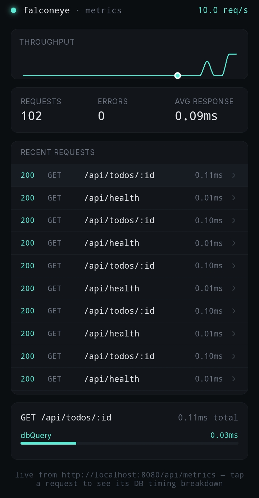

# FalconEye

<p align="center">
  
  
  
  
</p>

<p align="center">
  <a href="https://github.com/privateMwb/FalconEye/actions/workflows/build.yml">
    
  </a>
  <a href="https://github.com/privateMwb/FalconEye/actions/workflows/frontend.yml">
    
  </a>
  <a href="https://github.com/privateMwb/FalconEye/actions/workflows/sanitizers.yml">
    
  </a>
  <a href="https://github.com/privateMwb/FalconEye/actions/workflows/clang-tidy.yml">
    
  </a>
  <a href="https://github.com/privateMwb/FalconEye/actions/workflows/clang-format.yml">
    
  </a>
  <a href="https://github.com/privateMwb/FalconEye/actions/workflows/docs.yml">
    
  </a>
  <a href="https://github.com/privateMwb/FalconEye/actions/workflows/release.yml">
    
  </a>
</p>

<p align="center">
  
  
</p>

FalconEye is a live observability dashboard, currently built for [FalconHTTP](https://github.com/privateMwb/FalconHTTP) servers — a `Metrics` middleware that records per-request and per-database-call timing into a JSON endpoint, paired with a React dashboard that polls it and renders throughput, error rate, and request-level timing breakdowns in real time. The dashboard itself only depends on the `/api/metrics` JSON shape, not on FalconHTTP directly — see [Known Limitations](#known-limitations).

<p align="center">
  
</p>

> The screenshot above is a placeholder path (`docs/assets/dashboard.png`) —
> add a real capture of the running dashboard there before publishing. Grab
> it from a desktop browser at `localhost:5173` with the server handling a
> realistic mix of traffic (some errors, some DB-backed requests), not a
> mobile emulator view with the browser's dev-tools chrome visible.

## 📑 Table of Contents

- [Features](#features)
- [Requirements](#requirements)
- [Dependencies](#dependencies)
- [Installation](#installation)
- [Quick Start](#quick-start)
- [Project Structure](#project-structure)
- [Development](#development)
- [Known Limitations](#known-limitations)
- [Documentation](#documentation)
- [Contributing](#contributing)
- [Changelog](#changelog)
- [License](#license)

## <a id="features"></a>✨ Features

- **Onion-model request timing** — `Metrics` wraps `next()` in FalconHTTP's middleware chain, timing the full request/response cycle including the matched route handler. Registered last, so nothing downstream of it goes unmeasured.
- **Route pattern resolution, not raw paths** — `MetricEntry::route` reports `/api/todos/:id`, not `/api/todos/42`, by re-running FalconHTTP's own `PathMatcher::match()` against the live `Router`'s registered routes. No changes to FalconHTTP's source required.
- **Per-request DB call timing** — `timedCall()` wraps a MiniDB call at its route-handler call site and appends the result into that request's `breakdown` array, using a thread-local pointer scoped by `Metrics` around each request. No changes to MiniDB's source required.
- **Thread-safe, bounded memory** — a fixed-capacity ring buffer (default 50 entries, overwrite-oldest) guarded by a single mutex, since requests are dispatched across a thread pool and concurrent writes are the expected case, not an edge case.
- **Exceptions don't lose data** — a route handler that throws still gets its timing recorded before the exception reaches `Recovery` upstream.
- **Self-exclusion** — the dashboard's own polling traffic against `/api/metrics` is never recorded, so it can't crowd out real application requests or skew `requestCount`/`avgResponseMs`.
- **Live dashboard, not a static export** — the React frontend polls `/api/metrics` on an interval, with a derived requests-per-second sparkline, a scrollable request log, and a click-through DB timing breakdown per request.

## <a id="requirements"></a>📋 Requirements

- A C++23-conformant compiler — verified on GCC and Clang, Linux only (see [Known Limitations](#known-limitations))
- CMake 3.20+
- Node.js 20+ and npm, for the frontend
- Git submodules initialized — FalconEye is a consumer application built on two of this author's own projects (see [Dependencies](#dependencies)) and needs their source present to build

## <a id="dependencies"></a>🔗 Dependencies

| Dependency | Provides | Repository |
|---|---|---|
| FalconHTTP | The HTTP server, router, and middleware chain `Metrics` is written against | [privateMwb/FalconHTTP](https://github.com/privateMwb/FalconHTTP) |
| MiniDB | The embedded database `timedCall()` instruments | [privateMwb/MiniDB](https://github.com/privateMwb/MiniDB) |

Both are vendored as git submodules under `server/third_party/` and built from source via `add_subdirectory()` — there is no package manager step, since each submodule already vendors its own dependencies.

**Frontend:** React 18, Vite, Recharts, and lucide-react — managed normally via `frontend/package.json`.

## <a id="installation"></a>📦 Installation

```bash
git clone --recurse-submodules https://github.com/privateMwb/FalconEye.git
cd FalconEye
```

**Server:**

```bash
cd server
cmake -B build
cmake --build build
./build/falconeye_server
```

**Frontend**, in a separate terminal:

```bash
cd frontend
npm install
npm run dev
```

Open `http://localhost:5173` — the dashboard polls `http://localhost:8080/api/metrics` every 3 seconds.

## <a id="quick-start"></a>🚀 Quick Start

Wiring `Metrics` into a FalconHTTP server:

```cpp
#include <FalconHTTP/Core/Server.h>
#include <FalconHTTP/Routing/Router.h>
#include "Metrics.h"
#include "MetricsJson.h"

FalconHTTP::Routing::Router router;
// ... register your own routes on router ...

Metrics metrics(router, /*bufferCapacity=*/50);

router.get("/api/metrics", [&metrics](const auto&, auto& response) {
    response.setJson(metricsToJson(metrics));
});

FalconHTTP::Core::Server server(router, /*threadCount=*/4);
server.use(FalconHTTP::Middleware::Recovery{});
server.use(FalconHTTP::Middleware::Logger{});
server.use(metrics); // last — captures the full request, including the handler

server.start(8080);
server.run();
```

Timing a database call inside a route handler:

```cpp
#include "DbTiming.h"

router.get("/api/todos/:id", [&](const auto& request, auto& response) {
    auto id = std::stoul(request.pathParam("id"));

    auto result = timedCall("dbQuery", [&]() {
        return queryEngine.selectByID(*table, id);
    });
    // result's duration now lands in this request's `breakdown` array
});
```

The response from `GET /api/metrics`:

```json
{
  "requestCount": 214,
  "errorCount": 3,
  "avgResponseMs": 4.82,
  "recentRequests": [
    {
      "route": "/api/todos/:id",
      "method": "GET",
      "status": 200,
      "totalMs": 12.48,
      "timestamp": "2026-08-11T09:41:02Z",
      "breakdown": [{ "name": "dbQuery", "ms": 9.11 }]
    }
  ]
}
```

## <a id="project-structure"></a>🗂️ Project Structure

```
FalconEye/
├── server/
│   ├── include/
│   │   ├── Metrics.h
│   │   ├── DbTiming.h
│   │   └── MetricsJson.h
│   ├── src/
│   │   ├── main.cpp
│   │   └── routes/
│   │       └── ExampleRoutes.h
│   ├── third_party/
│   │   ├── falconhttp/
│   │   └── minidb/
│   └── CMakeLists.txt
│
├── frontend/
│   ├── src/
│   │   ├── main.jsx
│   │   ├── App.jsx
│   │   └── index.css
│   ├── index.html
│   ├── package.json
│   └── vite.config.js
│
├── docs/
│   ├── Doxyfile
│   └── assets/
│       └── dashboard.png
│
├── .github/
│   ├── releases/
│   └── workflows/
│
├── .clang-format
├── .clang-tidy
├── .gitignore
├── README.md
└── LICENSE
```

## <a id="development"></a>🛠️ Development

**Build the server** (Debug by default):

```bash
cd server
cmake -B build -DCMAKE_BUILD_TYPE=Debug
cmake --build build
```

**Run the frontend dev server:**

```bash
cd frontend
npm run dev
```

**Check formatting and static analysis locally**, same checks CI runs:

```bash
find server/include server/src \( -name "*.h" -o -name "*.cpp" \) -exec clang-format --dry-run --Werror {} +
clang-tidy -p server/build $(find server/include server/src -name "*.h" -o -name "*.cpp")
```

**Build the frontend for production:**

```bash
cd frontend
npm run build
```

## <a id="known-limitations"></a>⚠️ Known Limitations

- **The dashboard is backend-agnostic; the middleware is not.** The React frontend only depends on `/api/metrics`'s JSON shape (`requestCount`, `errorCount`, `avgResponseMs`, `recentRequests[]`) — any backend serving that shape works unmodified. `Metrics.h`, by contrast, is written directly against FalconHTTP's `MiddlewareFn` signature and `Router`/`PathMatcher` APIs; using a different backend framework means reimplementing the middleware against that framework's equivalent hooks, producing the same JSON contract.
- **`breakdown` only reports database calls, not per-middleware timing.** `Recovery`, `Logger`, and `Cors` are compiled into the untouched `falconhttp/` submodule and have no hook into `timedCall()`'s mechanism — only calls explicitly wrapped at a route-handler call site (like `dbQuery`) show up.
- **Linux only, currently.** Everything in this project has been built and run on Linux (GCC and Clang). FalconHTTP's socket code hasn't been verified for POSIX-only assumptions, and nothing here has been tested on macOS or MSVC — CI reflects this rather than claiming untested support.
- **No automated test suite yet.** CI verifies the project builds, is clang-format/clang-tidy clean, and boots correctly under ASan/UBSan/TSan against a handful of real requests — it does not yet run a sanitized test suite, and there is no code coverage reporting as a result.

## <a id="documentation"></a>📖 Documentation

Full API reference, generated with Doxygen from `docs/Doxyfile`:

**https://privateMwb.github.io/FalconEye/**

## <a id="contributing"></a>🤝 Contributing

Issues and pull requests are welcome. Before submitting a PR:

- Run `clang-format` and `clang-tidy` locally (see [Development](#development)) — CI enforces both
- If your change touches `Metrics.h`'s ring buffer or thread-local breakdown mechanism, note in your PR description how you verified it under concurrent load (the `sanitizers.yml` TSan job is the closest thing to a regression check for this today)

## <a id="changelog"></a>📝 Changelog

See the [Releases](https://github.com/privateMwb/FalconEye/releases) page for version history and release notes.

## <a id="license"></a>📄 License

MIT — see [LICENSE](LICENSE) for details.
